# Project description

For this project, I'm tasked with scaling up an e-NABLE hand and building it with the toolkit. Me and my teammate Ivy downloaded the files for the UnLimbited Phoenix Hand right hand model, and we started working on it.
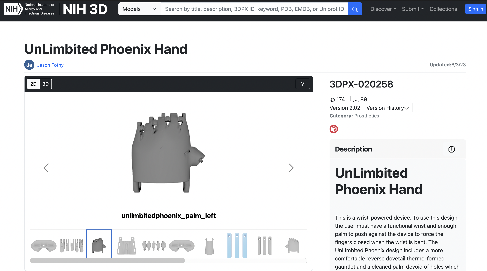
  

# Printing process
Initially, we thought we were going to use Raise3D printers, so we scaled the model to 150% sliced it in Ideamaker. Here are some screenshots:
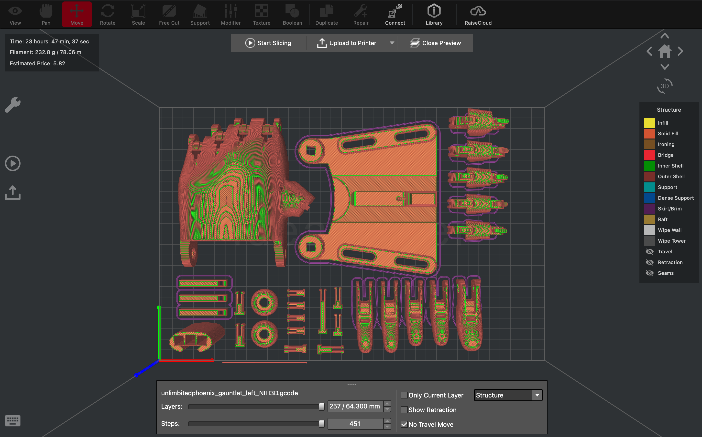
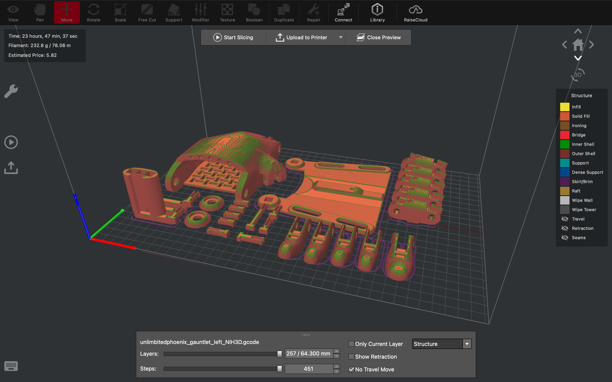
  

But turns out that all the Raise3D printers were taken, so we opted for the smaller PrusaMinis. They are not bad in terms of quality, but we have to split our print onto several devices. Good thing is we can use different colors on different parts, so ours may look fancy.
  
Here it is in Prusa slicer (one of six):

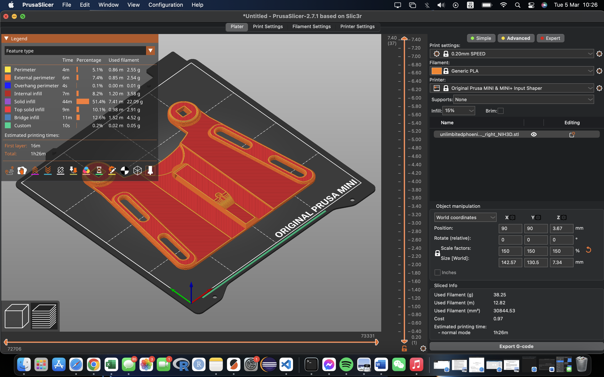

The printing process took a long time, as two of the prints failed and we had to reprint. After we have all the parts, it's time to mold the flat piece into a curved shape, using a heat gun and some PETG molds we were provided with. I forgot to document this process, but it was strange; it slowly started to bend after a bit of heating like it was cheese, then it slid right into the mold without me doing anything else. 
  This is the part that needed molding:

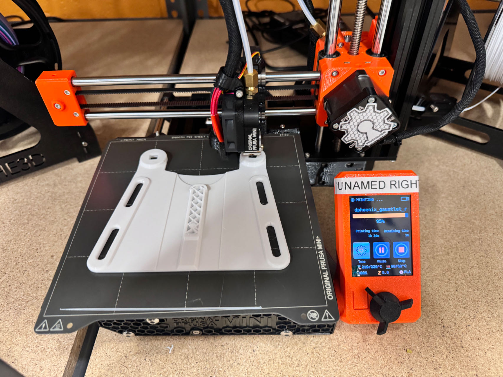

After molding:
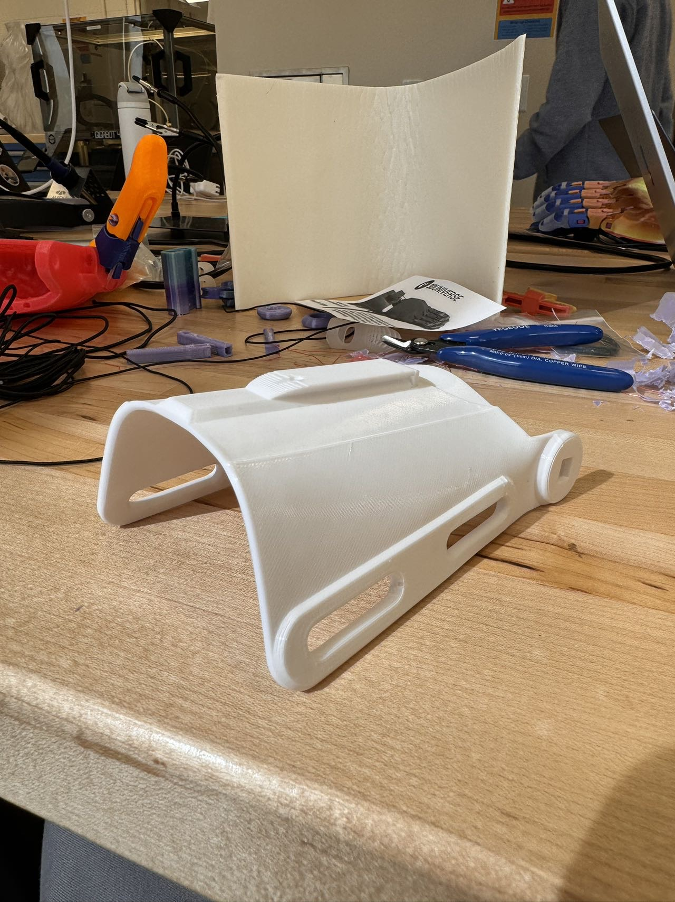

After getting all the parts ready, it's time to assemble. I looked at the videos they provided for installation:

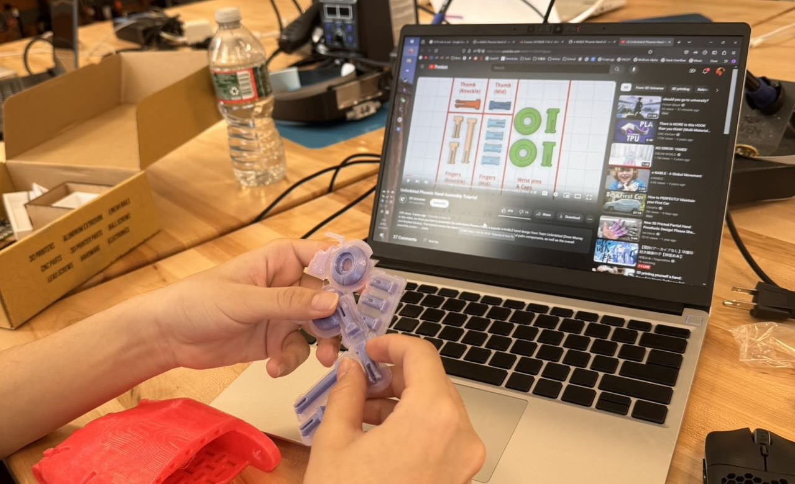
but then I figured that looking at a finished product would save more time, so I assembled the hand looking at the finished model, stringing through the holes and putting on rubber bands. It wasn't too hard, and here are some pictures of progress: 

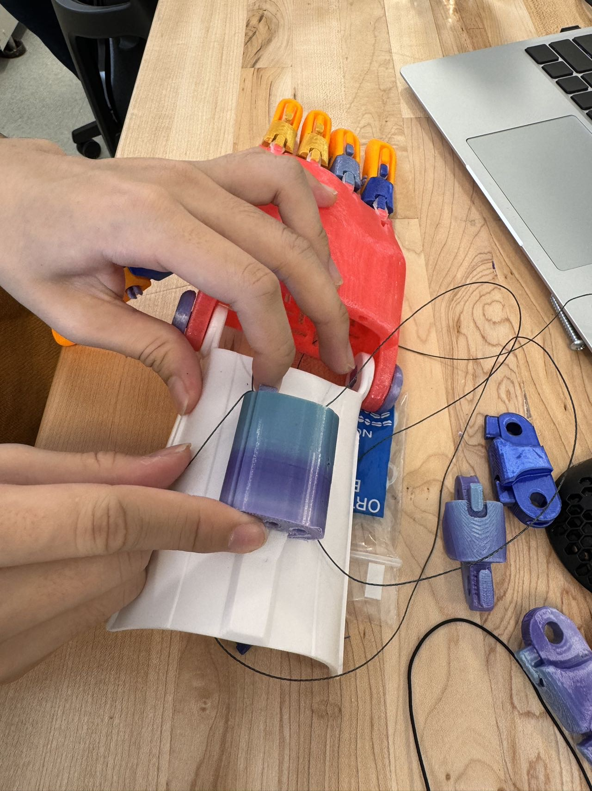
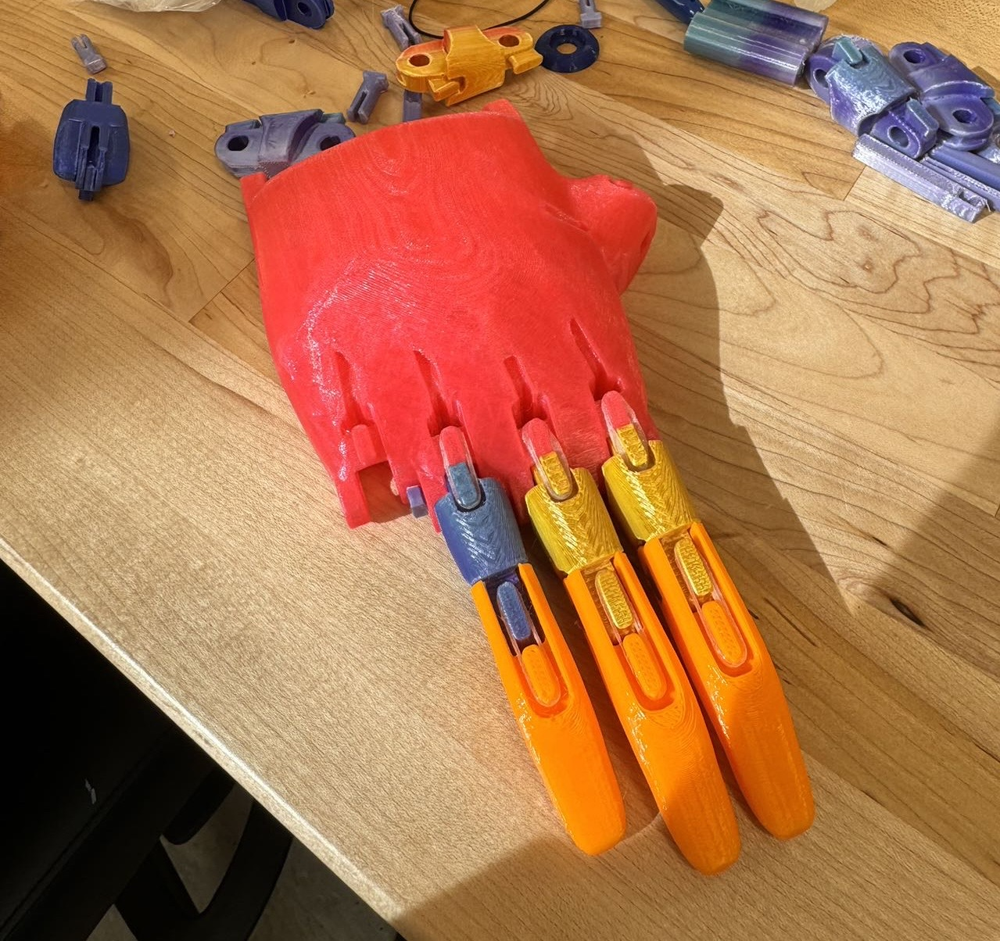

After assembling it all, I adjusted the string's length so all the fingers would move in sync with the wrist movement.

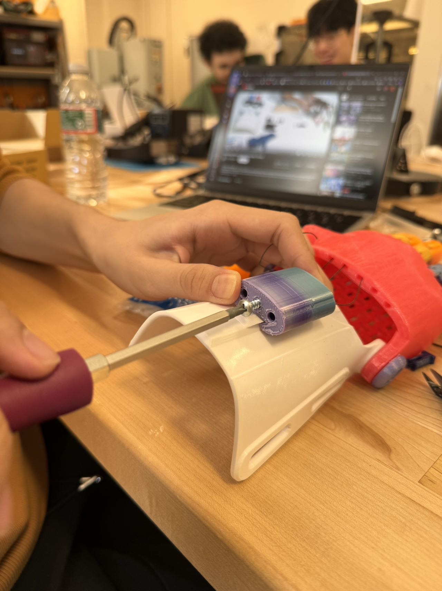

   
And... It's done!
 
Here it is by the window:
  
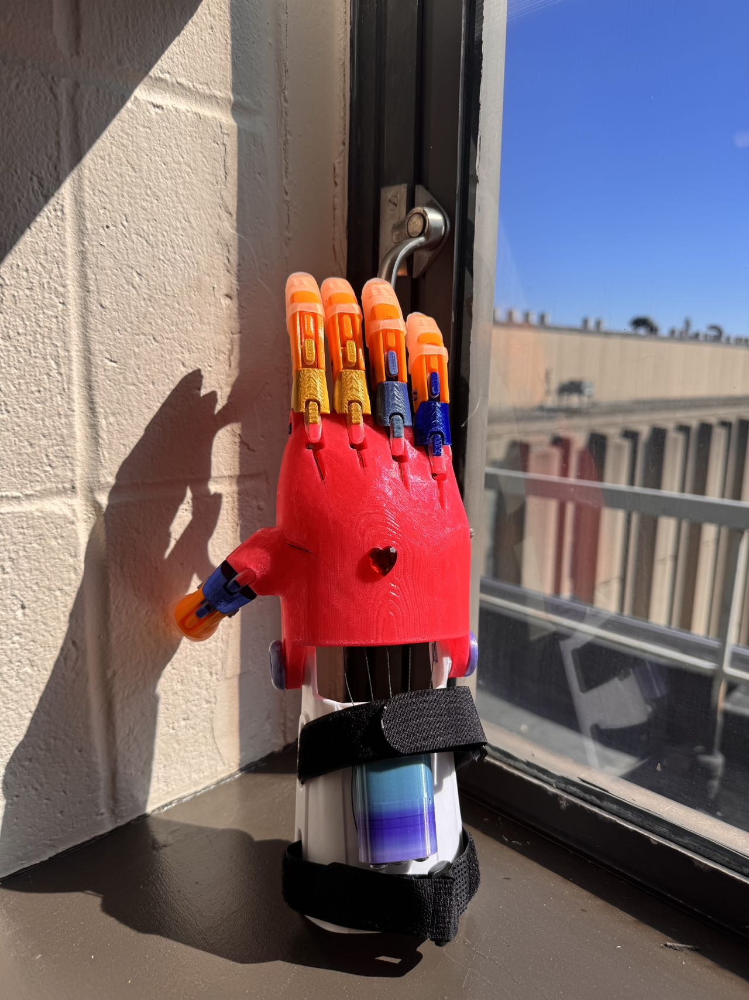
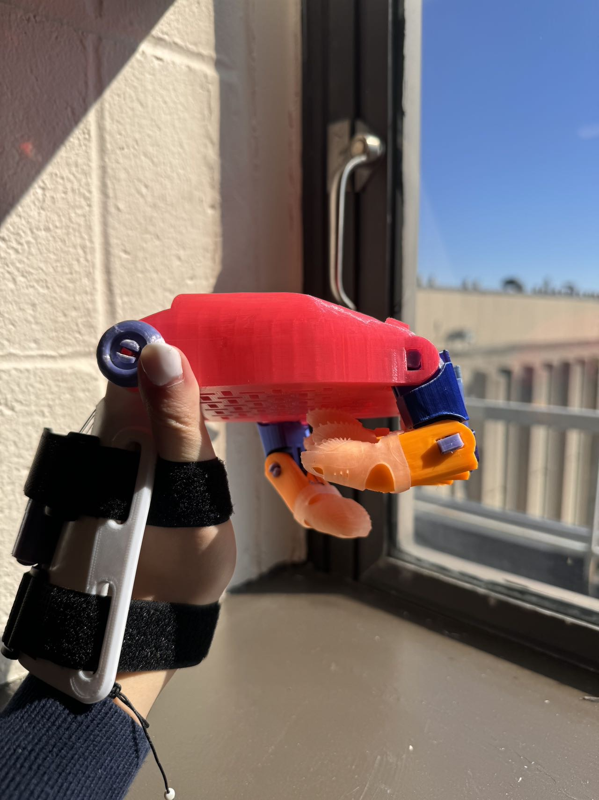
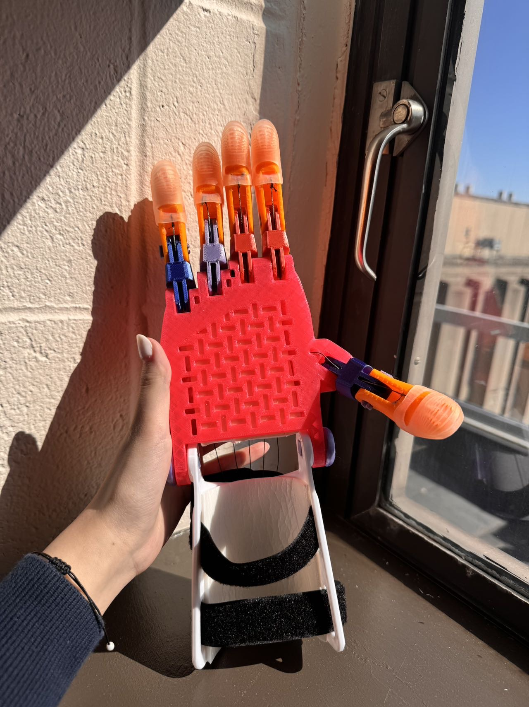

# Results
I'm very satisfied with the final product, if used correctly, it can hold a full water bottle easily, and I'm super proud of the efforts Ivy and I put in it that eventually made this work. We enjoyed the process of printing and also assembleing with and without the manual, as solving the problems we face with trial and error on the hands-on experience was a great opportunity for us to become critical thinkers, observers, and problem solvers.
