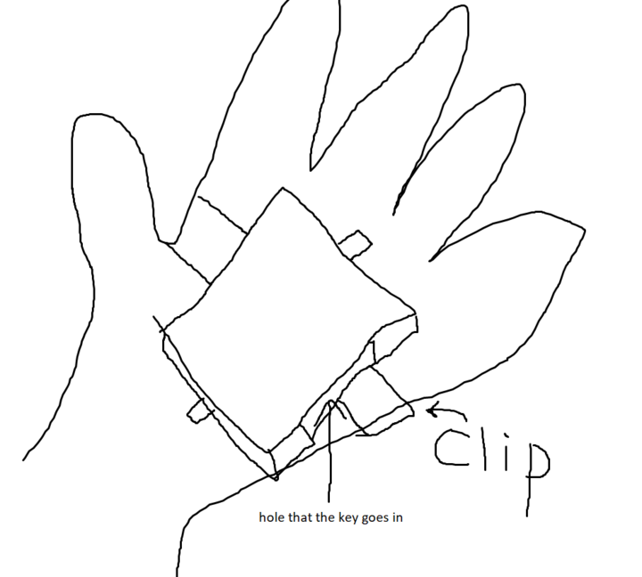
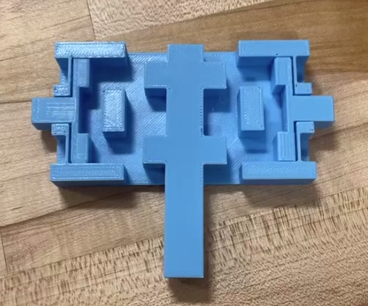
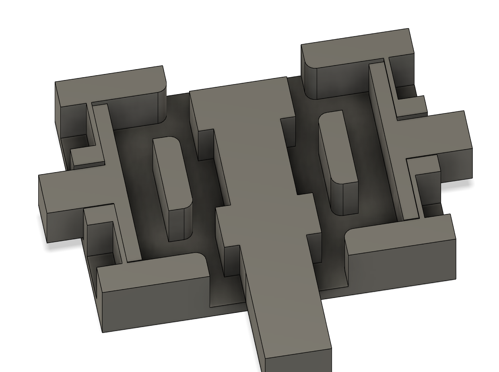
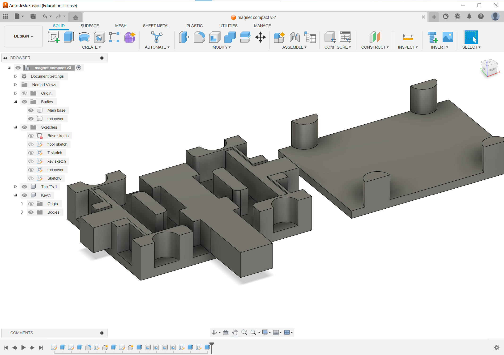
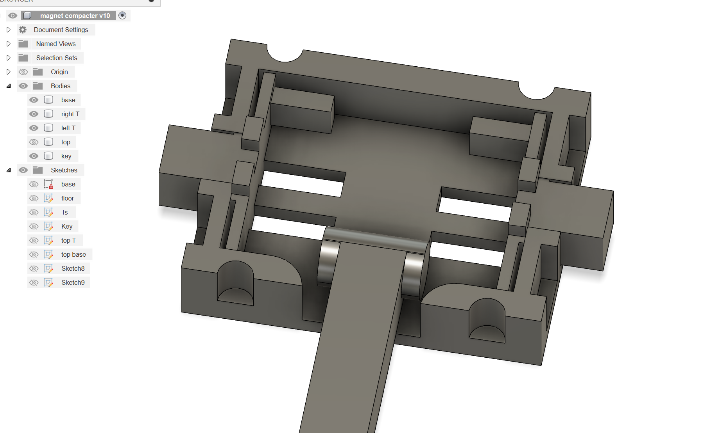

# Need Statement
Our users need a way to complete casual daily activities that is immediately and readily accessible, easy to use(without directions), and to have our attachments be quickly attached on to reduce assembly time so that they can gain similar efficiency as individuals with two hands. 

# Design Principles
My design should be and alternative to the mechanism my group is working on, so I'm working on my own here. I was brainstorming about ideas for an easier mechanism for taking it off and putting it on, so I thought of something that would utilize magnets to make a automatic lock, like the small tags being used in clothing stores to prevent theft that can be removed with a device with a magnet at checkout. It should fit on the client's hand like this:

It should be:
- Easy to detach/attach (smooth)
- Small footprint
- Rounded corners (so that it's comfortable to wear)
- Durable, magnets shouldn't fall off or break

  
## Here are a few mechanisms I was looking at for inspiration: 
 

This one utilized gravity, but sadly I cannot use gravity in my design. When the clients move around, this won't be as stable and it will detach or become loose when not wanted. However, I can replace the gravity part with springs, but as the size of the springs are hard to get right and I've never worked with one before, it's probably not a good idea given the time constraints of this project, I'm sure it will work but pairing magnets with springs seemed strange, so as I'm already working with magnets, I replaced the springs with magnets, so to make an entire mechanism out of 3D printed parts and magnets. In the class discussion session (sorry), I started drawing a design on the back of a worksheet:

I'm pretty satisfied on this design, so I made it in fusion 360. This is version 1:

after printing:

After testing it out, I found version 1 had a few design flaws. Some measurements were not right, and the magnets are too stiff to remove. So I improved it in version 2:

although this version is quite good, I don't think it is worth a print. I was planning to use this and make an acrylic cover to showcase how this mechanism worked, but as time was running out, I proceeded to make v3. However, I learned a lot in the development of this version and improved it in v3:

In this iteration, I made a cap for it, as well as a smaller footprint and rounding out the corners for smoother sliding. This is the iteration where I started adding the magnets. Here's how it looks after adding the magnets:

After a while of playing with it, I found some places where I can improve on it:
- The wall on the side is too thin, and makes it hard to take off after the magnets sticks. I should make it thicker by 2-3mm.
- Two sets of magnets is kind of overkill, and the top part of the 'key' sticks to the bottom set of magnets. 
- It is smoother than before, but it is still hard to take off / put on.
- The magnets kinda fall off after some use because superglue is not that strong on smooth surfaces.
  
So to deal with these problems, I think it's good to remake another version that solve them all, or at least tries to. So here comes v4:

As seen here, I changed it to use guide rails instead of the old blocking mechanism. I also added a curved top part so that when the user can lift the key, it automatically centers, or if the user is not convenient enough to put the key through, they can fix the key to a table and 'put the lock onto the key' and rotate it to center it, if you know what I mean. This is the point that I realized that I was designing in 3 dimensions instead of 2, and I can explore a lot more than just on flat planes. This opened up a lot of freedom, but at this stage I feel like I'm still only designing on a 'layered 2D' level, and I'm not understanding 3D designing fully. But anyways, I printed it and here it is:

This is the final print for my mechanism, but sadly the curved top part isn't good enough to center the key. The mechanism works, but while we switched to hot glue instead of superglue, I feel like it takes less effort to rip the magnets off. It's a hard thing to test with the force gauge, but I tried glueing both sides of a magnet to a 3D print and pulling it with the gauge, and it was around 20Ns when the magnet came off. It might have been the case that the magnet peels off from the side instead of all together, but it cannot be helped and it will happen in real use cases too. Good thing is, it is not the magnets that really holds the weight of the attachment, so it's not that big a deal.

# Reflections

Through the process of designing, it was important to me that the design should be as easy to use as possible, but I still feel like I fell into a trap of trying to make my design as 'creative and innovative' as possible without paying attention to the actual use cases for this product. I didn't fall that deep down the trap though, as the base functions still work as intended, but in general I would think that this was successful.

  