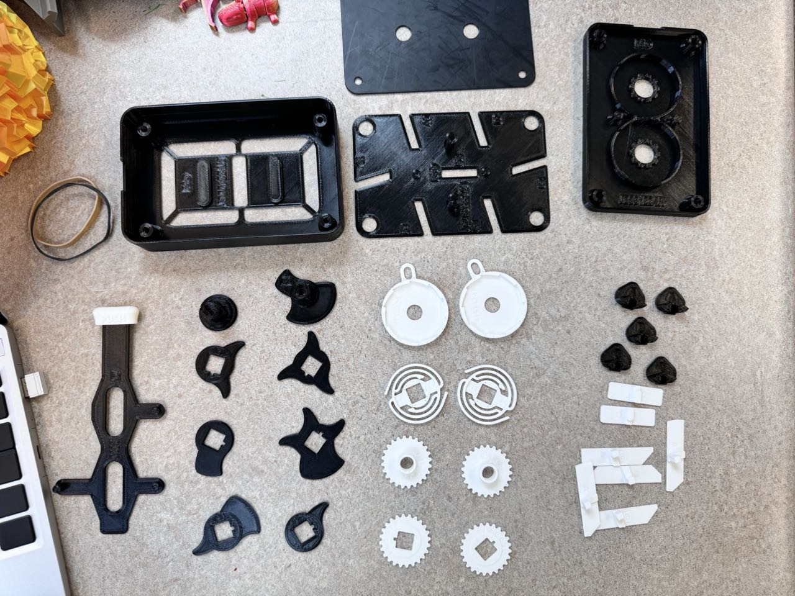
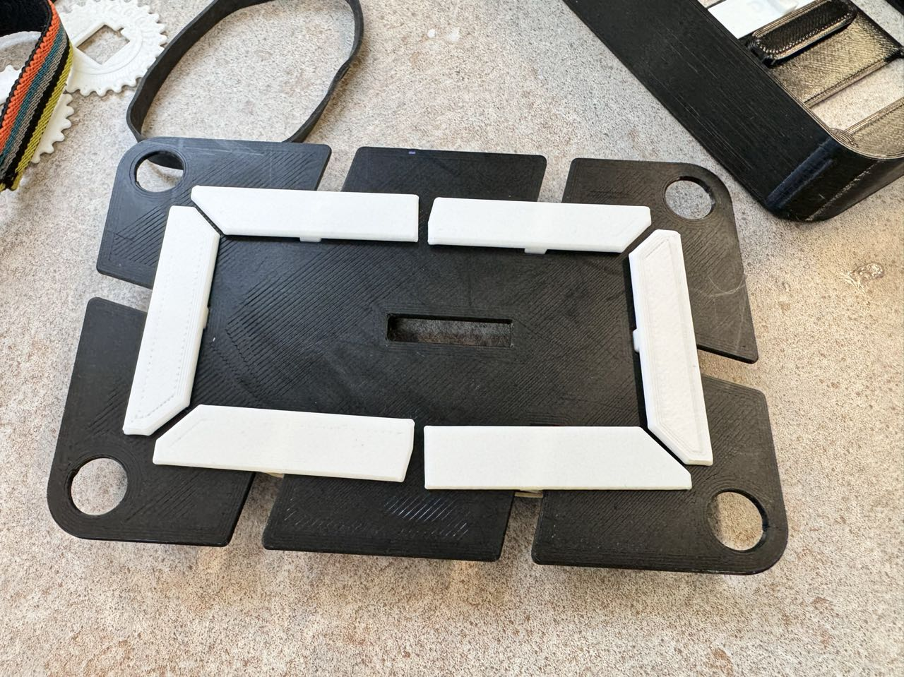
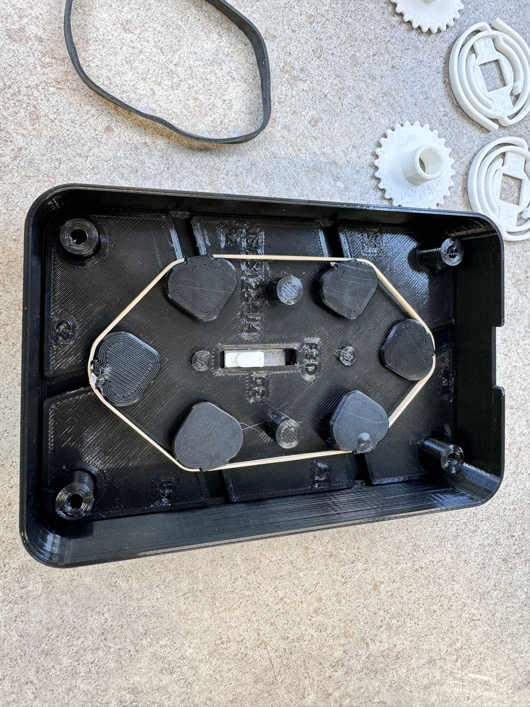
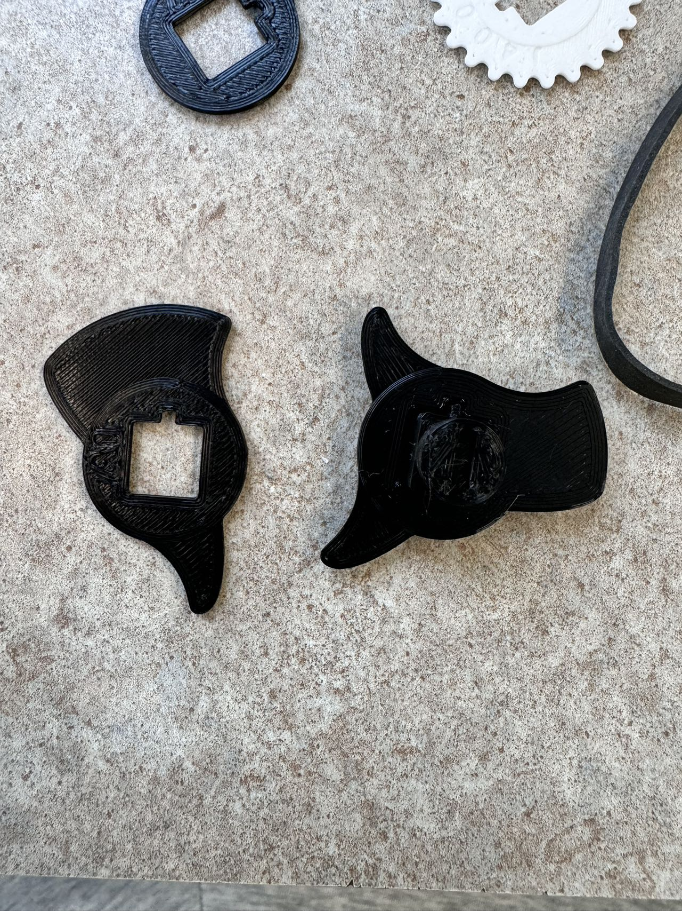
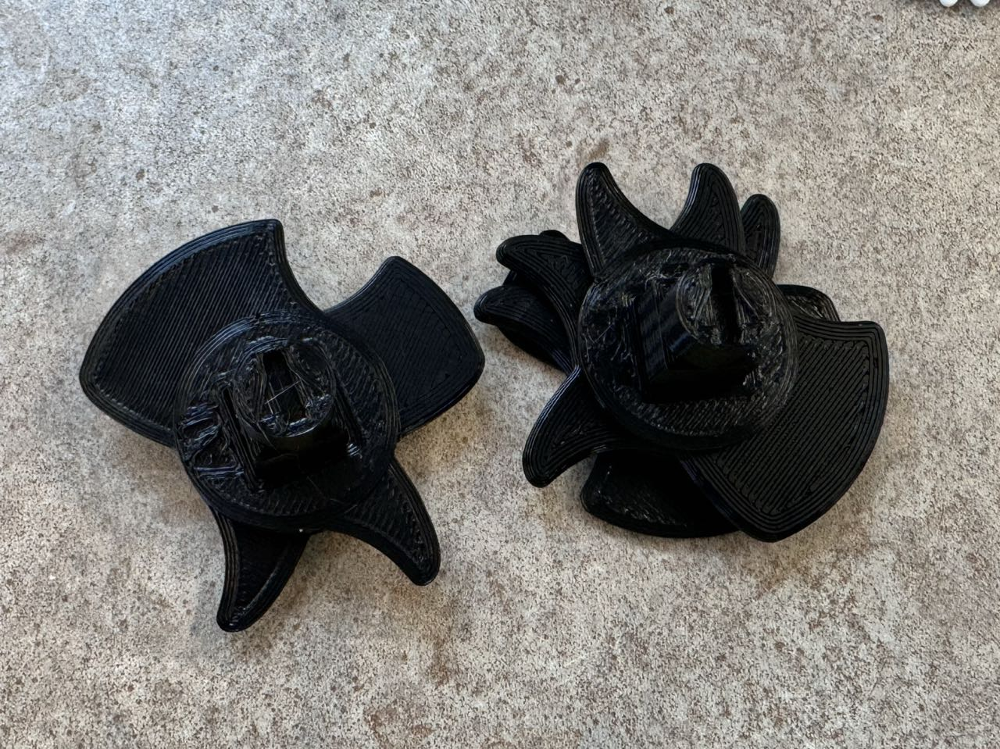
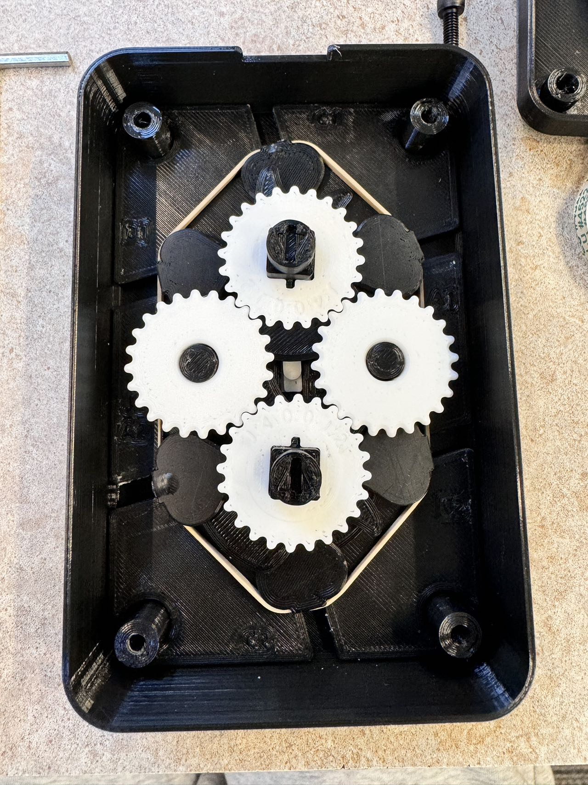
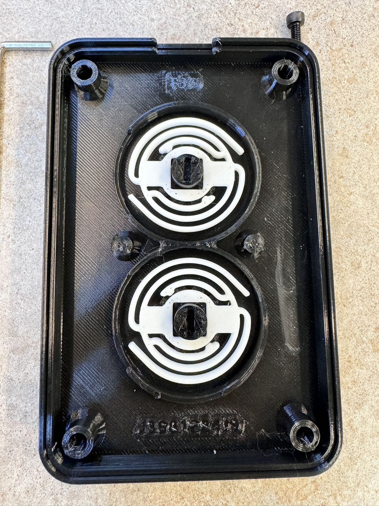
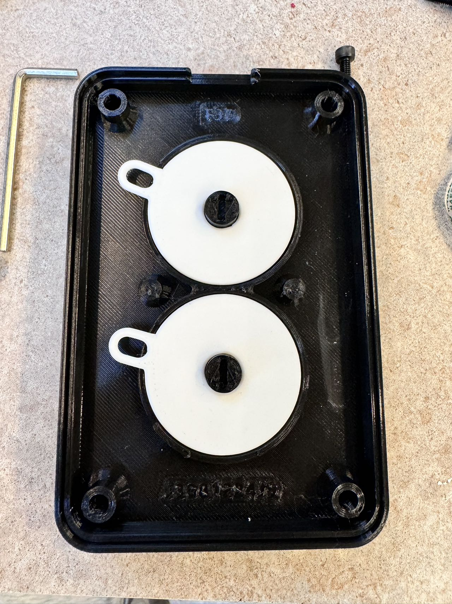
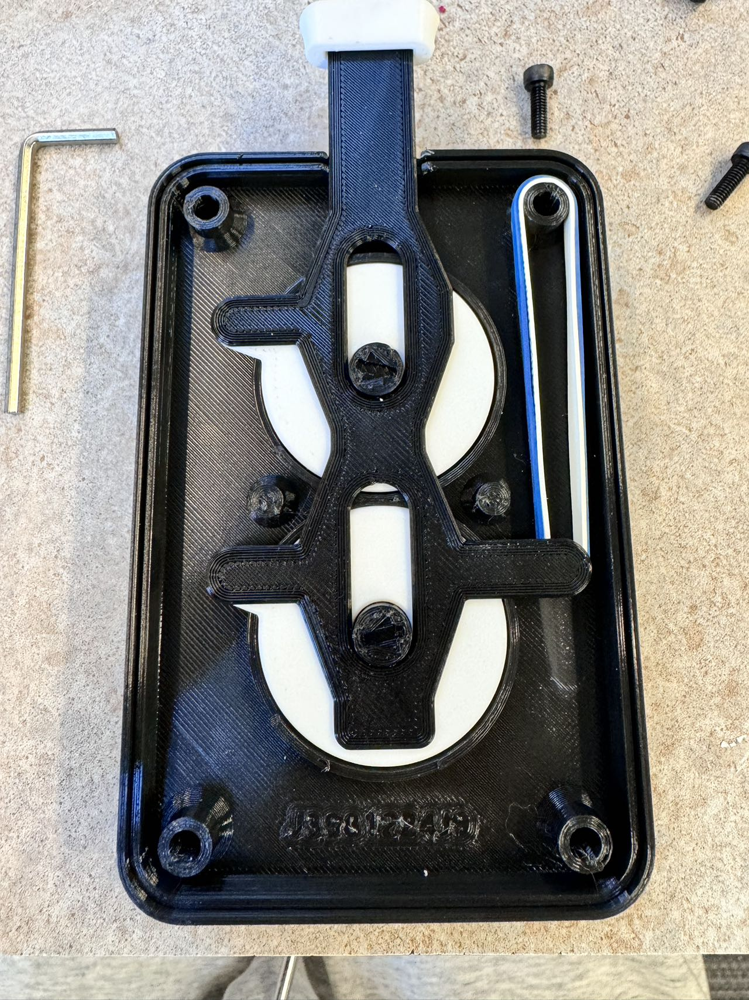
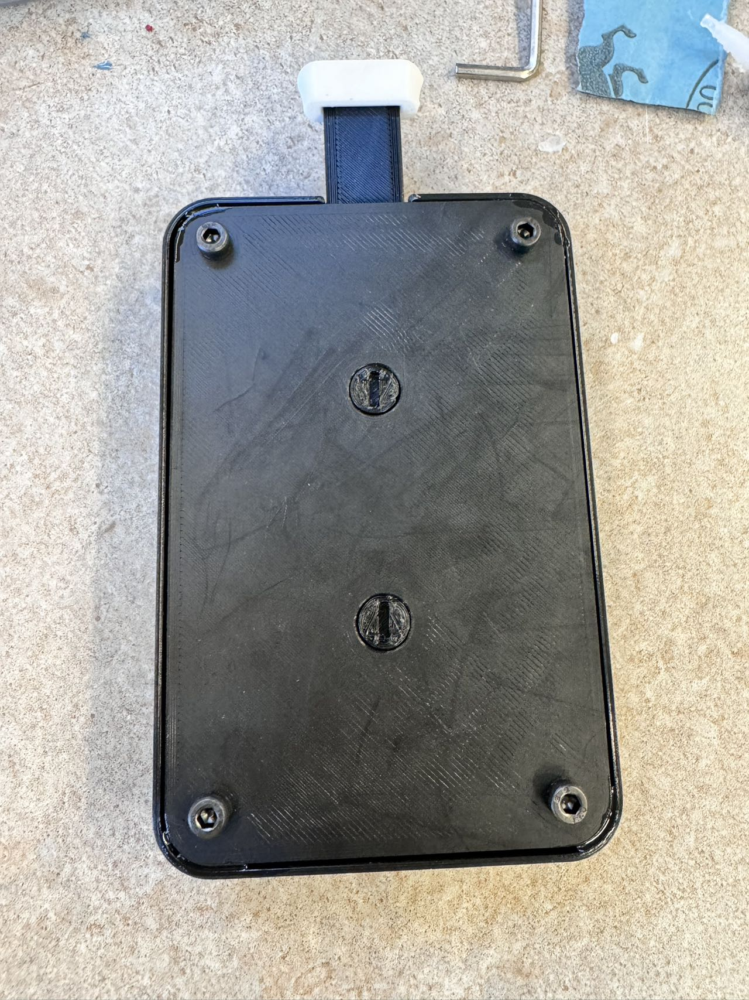

# Introduction to the Bonus Project

For the bonus project, my classmates suggested making something like the e-Nabled hand from a previous assignment, but I was looking for a project that required less preparation, such as getting molds ready and ordering kits from Amazon. I stumbled upon a fascinating project while browsing on [printables.com](https://www.printables.com/).

## Project Choice: Pure 3D-printed Mechanical Counter

I found the [Pure 3D-printed mechanical counter](https://www.printables.com/model/860058-7-segment-mechanical-counter-version-2-ratchet) and was immediately captivated by the complex design and I am amazed by the design and the mechanism, so I had to make one myself. I downloaded the files and started printed them.

# Printing Process
There are some files that needed 2 copies of and some need only one, but they are really similar and I made some mistakes while slicing them, so I had to print out the parts multiple times. The color of the parts mattered (a lot), which I hope the author would've marked on the files, as it's where most of my problems was with. However, after a few tries, I got it right. Here are all the parts layed out: 

I will go through the mechanism as we move on. There is a front casing where everything gets put in, a plate behind it to hide the numbers and the mechanism, a mid plate that holds the cogwheels, and a back plate that holds the ratchet mechanism. 
 

# Assembly Process

## The white strips

This is the most time-consuming part to get right, I spent about 3 hours just calibrating this so that the little black triangles are smooth to push with the CAMs, which I'll talk about in a bit. The author suggested using superglue to glue the little triangles to the white number strips, but I didn't have it at the time, so I went with hot glue. It was a bad idea, as the hot glue was too thick and the numbers didn't move smoothly due to slight changes in the dimensions, even after calibrating it, did not turn out well. It was a good lesson to me-hot glue is horrible, and if the glue gun is too close to the PLA, it will melt it. Hot glue is not good for precision work especially if you want the outcome to be neat.
 
So in the end, I had to clean and redo it with superglue, and it was much better. The numbers are held in place through a slight crack which it can free fall through smoothly. Here's the backside of the number plate: 

As you can see, they're all held in place with a single thin rubber band, which doesn't provide that much tension, making it easy to push outwards with the CAMs, which looks like this: 

### the CAMs

These are the CAMs, they are stacked on top of each other on a main CAM with a square pole in the middle. Other CAMs are stacked on the square pole, and they'll all be held in place by a mid plate that has a hole just slightly bigger so that it pushes the other CAMs down, forcing them to behave. They are the ones that rotate and push away the white strips and therefore forming the numbers, which is (in my opinion) the most complex and important part of the design, it's also the hardest to get it to work as many times the heights just won't align. 
 
Here's a picture of them stacked together: 

It can be printed as a single body, but I think the author chose to separate them so it has a stronger structure and a higher customizability, because changing the shape of the CAMs determines how the white strips collaborate with each other. When I built to this part of the design, it made me smile because it was so clever and simple, yet so effective. 
 
With that all said, here's a picture of the front casing with the CAMs and the paring cogs in place: 

### Cogs and Alignment

 
The cogs fit on the square poles too, and they're there to keep the two rotating CAMs in sync so they show numbers instead of random shapes. Here is where we put on the mid plate to secure everything we just made: 

## Mid and Back Plate Installation

### Springs and Caps

Oops, I forgot to take a picture before putting the spring in there. Here is where the ratchet mechanism will be housed. It starts with the springs that work in conjunction with its cap to prevent the bottom poles from rotating backwards after each press. For every rotation, the ratchet will push down on the caps, rotating them down, with the spring. But when it pops back, the grooves on the inside of the ratchet will prevent the springs from doing so, thus restricting it to only go in one direction, ensuring movement to not be back and forth.  
Here's a picture of the caps in place: 

Now it's time to install the ratchet: 

### Ratchet

As shown in the picture, I used two rubber bands to strengthen it, giving smoother and more responsive results. The time it takes to bounce back is significantly shortened. The ratchet mechanism is the most fun part of the design, and I find it satisfying to play with. With all this done, I did a few test runs and it sort of worked well. The white strips won't "hide" entirely to the side when it needs to, especially when a lot of them needs to be hidden. I think it's due to the first rubber band being too tight, so I looked around the Makerlab trying to find a looser one, I even tried the used ones in the "finished prints" box, but I couldn't find any. So I buried the thought and screwed in the back plate. Here's a picture of the final product: 

This was also a bit hard to get right, as the screw holes were designed for #8 wood screws, and I didn't have any. I ended up using the M4 screws in the Makerlab as they had the closest diameter to the #8s, but they had a flat head and didn't want to go in far, so I used a big screwdriver to slightly open up the holes for them. It was a bit of a hassle, but it worked out in the end.
 
Here's a video of it in action: 

<video controls src="../picture/bonus/video.mp4" title="working"></video>

# Summary

This was a great project to work on, as it was complex and fun to make. I learned a lot about how to design mechanisms, and how to tweak it to make it work well; and I should've asked for help when I needed it (thanks Harrison!). 
  

  